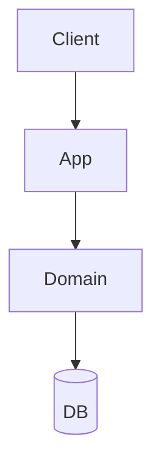

# アーキテクチャ詳細: <architecture-name>

> 構成図や設計判断の詳細を記述します。図は Mermaid 推奨。

## コンテキスト / 題材

<このサンプルが扱う題材（ToDo、EC など）と前提>

## 構成図

## レイヤ / コンポーネントの責務

| 要素 | 責務 |
| --- | --- |
| <Presentation> | <...> |
| <Application> | <...> |
| <Domain> | <...> |
| <Infrastructure> | <...> |

## 主要な設計判断

- <判断 1 とその理由>
- <判断 2 とその理由>

## データフロー（代表シナリオ）

1. <ステップ 1>
2. <ステップ 2>

## 拡張ポイント / 既知の制約

- <...>
