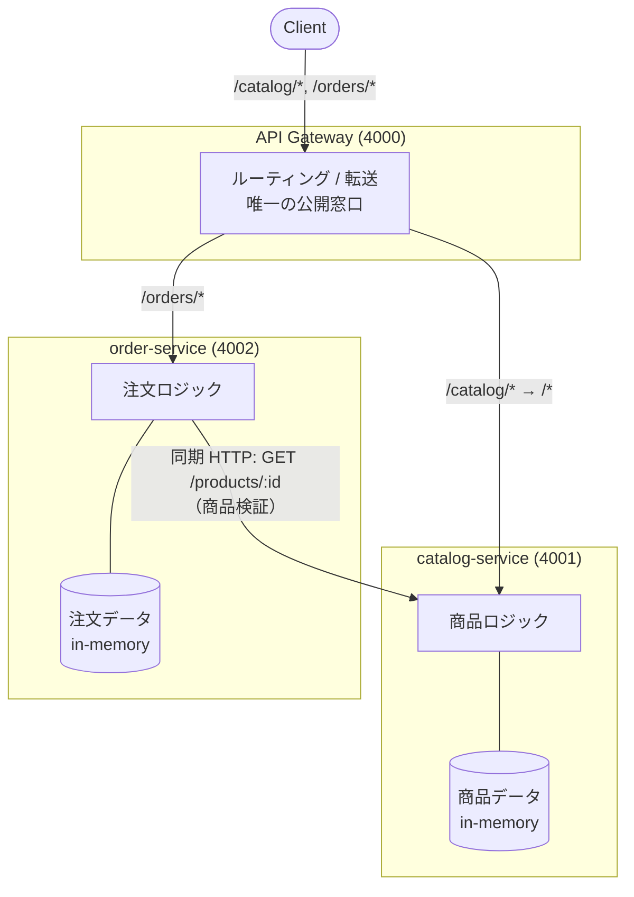
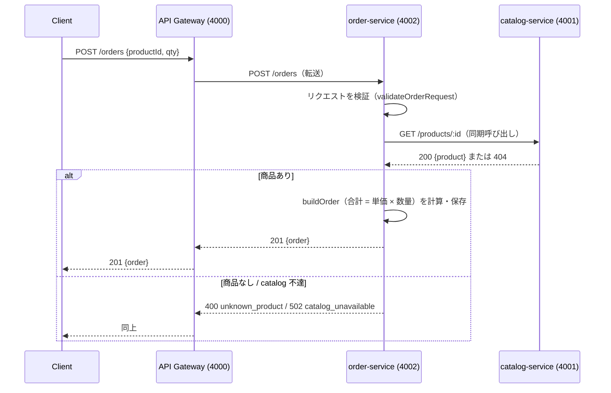

# アーキテクチャ詳細: service-per-domain-ts

マイクロサービス（service per domain）+ API ゲートウェイ構成のサンプル。
小さな EC バックエンドを「カタログ」「注文」のドメインに分割し、前段にゲートウェイを置く。

## コンテキスト / 題材

- 題材: ごく小さな EC バックエンド（商品カタログ + 注文）。
- 前提: 複数チームが**それぞれのサービスを独立して所有・開発・デプロイ**する大規模業務システムを想定。
- 制約: 外部依存なし・ビルド不要・完全オフライン（Node.js 22 の TypeScript 直接実行を利用）。

## 構成図

## レイヤ / コンポーネントの責務

| 要素 | 責務 | データ所有 |
| --- | --- | --- |
| **api-gateway** (4000) | クライアントへの唯一の公開窓口。パスに応じたルーティングと透過転送のみ。ドメインロジックは持たない。 | なし |
| **catalog-service** (4001) | 商品（id, name, priceYen）の参照を提供。`GET /products`, `GET /products/:id`。 | 商品データ（専用 in-memory） |
| **order-service** (4002) | 注文の作成・取得。`POST /orders`（catalog を同期呼び出して検証）, `GET /orders/:id`。 | 注文データ（専用 in-memory） |
| **shared/http.ts** | 汎用の JSON 送受信・サービス間呼び出しヘルパー。**ドメインロジックは含まない**。 | なし |
| **services/order/domain.ts** | 注文の純粋ロジック（合計計算・バリデーション・組み立て）。I/O なしで単体テスト可能。 | なし（純粋関数） |

## 主要な設計判断

### なぜサービスごとにデータを分けるか（Database per Service）
- 各サービスが自分のデータを**排他的に所有**することで、内部スキーマ変更が他チームに波及しない。
- データを共有テーブルで持つと結合が生まれ、独立デプロイ・独立スケールという目的が崩れる。
- 本サンプルでは catalog と order がそれぞれ別の in-memory ストアを持ち、order は商品データを**保持しない**。
  商品が必要なときだけ catalog に HTTP で問い合わせる。

### ゲートウェイの責務
- クライアントに対して**単一のエンドポイント**を提供し、内部のサービス分割を隠蔽する。
- 責務はルーティングと転送に限定し、ドメインロジック・データを持たない（薄く保つ）。
- 認証・レート制限・縮退などの横断的関心事を将来ここへ集約できる拡張点になる。

### サービス間通信
- order → catalog は **同期 HTTP 呼び出し**（`GET /products/:id`）。注文確定前に商品の存在・価格を検証する。
- 呼び出し先 URL は環境変数（`CATALOG_URL`）で差し替え可能にし、環境ごとのサービスディスカバリを想定。
- ネットワークは失敗しうる前提とし、catalog 不達時は order が **502** を返す（分散システム特有の失敗の明示）。
  実運用ではタイムアウト・リトライ・サーキットブレーカを足す。

## データフロー（代表シナリオ: `POST /orders`）

1. クライアントがゲートウェイへ `POST /orders` を送る。
2. ゲートウェイが order-service へそのまま転送する。
3. order-service がリクエスト（productId / qty）を検証する。
4. order-service が catalog-service を `GET /products/:id` で同期呼び出しし、商品を検証する。
5. 商品が存在すれば、合計金額（単価 × 数量）を計算して注文を確定・保存し、`201 {order}` を返す。
6. 商品が無ければ `400`、catalog に到達できなければ `502` を返す。

## 拡張ポイント / 既知の制約

- データは in-memory のためプロセス再起動で消える（サンプル簡略化のため）。実運用ではサービスごとに DB を持つ。
- サービス間呼び出しにタイムアウト・リトライ・サーキットブレーカは未実装。
- 認証・認可・レート制限・分散トレーシングは未実装（ゲートウェイ/各サービスへの追加点）。
- 複数サービスにまたがる整合性は結果整合（Saga 等）で扱う前提。本サンプルには含めていない。
