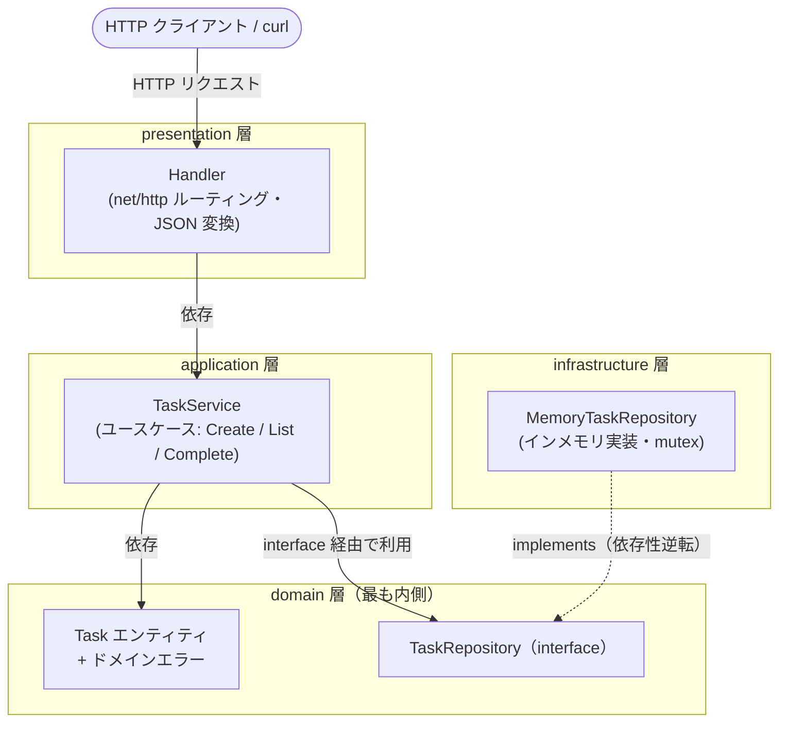

# アーキテクチャ詳細: layered-architecture-go

レイヤードアーキテクチャ（4 層）による社内向けタスク管理バックエンドの構成と設計判断をまとめます。

## コンテキスト / 題材

社内利用を想定したタスク管理（ToDo）の HTTP API です。`Task` は次のフィールドを持ちます。

| フィールド | 型 | 説明 |
| --- | --- | --- |
| id | string | 一意な識別子（サーバ側で生成） |
| title | string | タスク名（必須・200 文字以下） |
| done | bool | 完了フラグ |
| createdAt | time.Time | 作成日時 |

業務ルール（タイトルの妥当性など）はドメイン層に閉じ込め、HTTP や永続化技術から独立させています。

## 構成図

依存方向は外側の層から内側のドメイン層へ向きます。インフラ層は「ドメインが定義したインターフェースを実装する」
という形でドメインに依存します（依存性逆転の原則）。

## レイヤ / コンポーネントの責務

| 要素 | 責務 | 依存先 |
| --- | --- | --- |
| presentation (`internal/presentation`) | HTTP の入出力。リクエストの解釈、JSON の入出力、ドメインエラー → HTTP ステータスの変換。 | application |
| application (`internal/application`) | ユースケース（業務手続き）の調整。`TaskService` が Create / List / Complete を提供。 | domain（interface のみ） |
| domain (`internal/domain`) | 中核の業務ルール。`Task` エンティティと不変条件、`TaskRepository` インターフェース、ドメインエラー。 | なし（最も内側） |
| infrastructure (`internal/infrastructure`) | ドメインが定義したインターフェースの具体実装。インメモリの `TaskRepository`。 | domain |
| cmd/server (`cmd/server/main.go`) | 各層を結線（DI）し、HTTP サーバを起動するエントリポイント。 | 全層 |

## 主要な設計判断

- **インターフェースをドメイン層に置く（依存性逆転）**: `TaskRepository` を domain に定義することで、
  ドメイン／アプリケーション層は具体的な永続化技術を知らずに済みます。実装はインフラ層が提供し、
  依存の矢印は常に内側（ドメイン）へ向きます。これによりドメインが「最も安定した中心」になります。
- **インメモリ実装を差し替え可能にする**: `MemoryTaskRepository` はインターフェースの一実装にすぎません。
  RDB 実装（例: `PostgresTaskRepository`）を追加して `cmd/server/main.go` の結線を 1 行変えるだけで、
  上位層（application / presentation）のコードを一切変更せずに永続化技術を切り替えられます。
- **ID 生成と時刻を注入する**: `TaskService` は `IDGenerator` と `Clock` を受け取れます（`NewTaskServiceWith`）。
  テストで ID と時刻を固定でき、決定的で高速なユニットテストが書けます。
- **内部モデルと外部契約の分離**: presentation 層は `taskResponse` という DTO を返し、`domain.Task` を直接
  JSON 公開しません。内部モデルの変更が API 契約に直接漏れないようにしています。
- **エラーの集中変換**: ドメインエラー（`ErrNotFound` / `ErrEmptyTitle` / `ErrTitleTooLong`）を
  presentation 層の `statusForError` で HTTP ステータスへ対応付け、業務ルールが HTTP 知識を持たないようにします。
- **並行安全な永続化**: 複数の HTTP ハンドラから同時アクセスされるため、インメモリ実装は `sync.RWMutex` で保護し、
  保存・取得時には値をコピーして外部からの不変条件破壊を防ぎます。

## データフロー（代表シナリオ: POST /tasks）

1. クライアントが `POST /tasks` に `{"title":"..."}` を送信する。
2. presentation 層の `createTask` がリクエストボディを `createTaskRequest` にデコードする（不正な JSON は 400）。
3. `TaskService.Create(title)` を呼び出す。
4. application 層が `domain.NewTask(id, title, now)` でエンティティを生成する。
   ここでタイトルの不変条件（空でない・200 文字以下）が検証され、違反時はドメインエラーを返す。
5. `TaskRepository.Save(task)`（インフラ層のインメモリ実装）でタスクを永続化する。
6. presentation 層が結果を `taskResponse` に変換し、成功なら `201 Created` で JSON を返す。
   ドメインエラーの場合は `statusForError` により `400 Bad Request` 等へ変換して返す。

## 拡張ポイント / 既知の制約

- **永続化の差し替え**: `domain.TaskRepository` を実装すれば RDB / KVS などへ移行可能。
- **ユースケースの追加**: 更新・削除・期限管理などは `TaskService` にメソッドを追加し、必要なら新しいドメインルールを domain に足す。
- **既知の制約**: インメモリ実装のためプロセス再起動でデータは消える（サンプル用途）。認証・認可・ページングは未実装。
