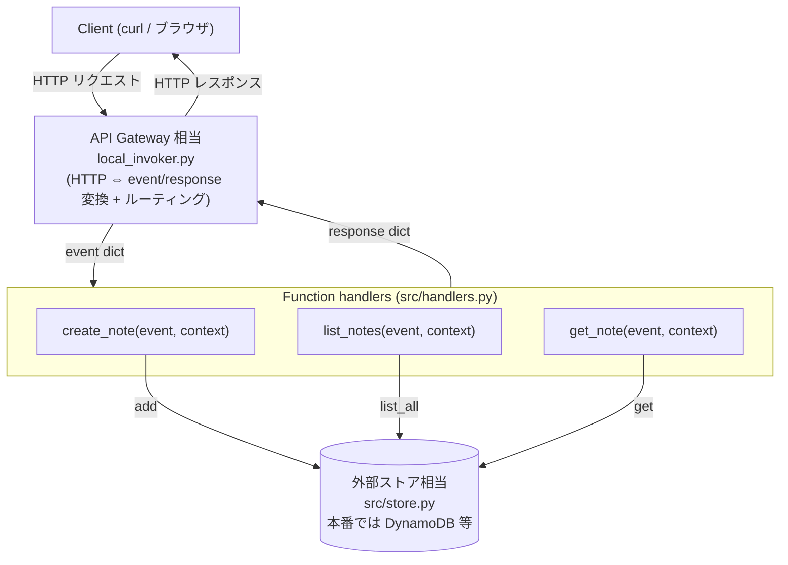

# アーキテクチャ詳細: faas-rest-api-python

サーバレス / FaaS で REST API を提供する構成の詳細を記述します。

## コンテキスト / 題材

題材は最小限の **メモ（notes）API** です。

| メソッド・パス | 説明 | 成功時 |
| --- | --- | --- |
| `POST /notes` | メモを作成（body: `{"text": "..."}`） | 201 `{id, text, createdAt}` |
| `GET /notes` | メモ一覧を取得 | 200 `[...]` |
| `GET /notes/{id}` | メモを1件取得 | 200 / 無ければ 404 |

前提として、各エンドポイントは AWS Lambda の関数 1 つ、ルーティングと
HTTP 変換は API Gateway が担う——というクラウド構成を想定しています。
本サンプルでは API Gateway の役割をローカルインボーカ（`local_invoker.py`）で模倣し、
クラウド未接続でも同じハンドラを動かせるようにしています。

## 構成図

## レイヤ / コンポーネントの責務

| 要素 | 責務 |
| --- | --- |
| Client | HTTP で API を呼び出す利用者（curl / ブラウザ / 他サービス）。 |
| API Gateway 相当（`local_invoker.py`） | 受信 HTTP を `event` dict に変換し、ルータでハンドラを引き当てて呼び出し、返ってきた `response` dict を HTTP に戻す。認証やスロットリングなどクラウド固有の処理の差し替え点でもある。 |
| Router（`src/router.py`） | `method + path` → ハンドラの対応付け。`{id}` のパスパラメータを抽出する純粋関数。HTTP を知らないので単体テスト可能。 |
| Function handlers（`src/handlers.py`） | `handler(event, context) -> response` の純粋関数群。ビジネスロジック（入力検証・ストア操作・レスポンス組み立て）を担う。Lambda の関数に相当。 |
| Store（`src/store.py`） | データ永続化の抽象。本サンプルはインメモリ実装だが、これは外部ストアのスタンドイン。本番では DynamoDB 等に置換する。 |

## 主要な設計判断

- **なぜハンドラを純粋関数にするか（テスト容易性・移植性）**
  各エンドポイントを `handler(event, context) -> response` という副作用の少ない関数に保つと、
  HTTP サーバを立てずに event dict を渡すだけで単体テストできる（`tests/test_handlers.py`）。
  また、ハンドラが HTTP やクラウド SDK に直接依存しないため、別のゲートウェイ実装や
  別クラウドへ載せ替えやすく、ベンダーロックインの影響を局所化できる。

- **なぜ invoker でゲートウェイを模すか**
  本番の API Gateway はクラウド上にあり、ローカルで動かせない。
  そこで `http.server`（標準ライブラリ）だけで HTTP ⇔ event/response の変換とルーティングを行う
  薄いインボーカを用意し、クラウド未接続・完全オフラインで FaaS の挙動を再現する。
  invoker はハンドラから見れば「ゲートウェイの差し替え可能な一実装」にすぎない。

- **ステートレス前提と外部ストア**
  FaaS の関数インスタンスはリクエスト間で状態を保持しない（破棄・複製され得る）。
  そのため状態は必ず関数の外（外部ストア）に置く。本サンプルのインメモリストアは
  あくまでローカルデモ用であり、本番では関数インスタンス間で状態が共有されないため使えない。
  `store.py` を独立させ、同じインターフェース（`add` / `list_all` / `get` / `clear`）越しに
  アクセスすることで、保存先の差し替えをハンドラに影響させずに行えるようにしている。

## データフロー（代表シナリオ: POST /notes）

1. **HTTP**: Client が `POST /notes` に `{"text":"牛乳を買う"}` を送信する。
2. **HTTP → event**: invoker が受信内容を `event` dict に変換する
   （`httpMethod="POST"`, `path="/notes"`, `body="{\"text\":\"牛乳を買う\"}"` など）。
3. **ルーティング**: `router.match("POST", "/notes")` が `create_note` ハンドラを返す
   （パスパラメータがあれば `pathParameters` に詰める）。
4. **handler**: invoker が `create_note(event, None)` を呼ぶ。
   ハンドラは `body` を JSON パースし、`text` を検証する（不正なら 400 を返す）。
5. **store**: 検証 OK なら `store.add(text)` を呼び、`{id, text, createdAt}` を採番・保存する
   （本番では外部 DB への書き込みに相当）。
6. **response**: ハンドラが
   `{"statusCode":201, "headers":{...}, "body":"<JSON 文字列>"}` を返す。
7. **event → HTTP**: invoker が `response` dict を実際の HTTP レスポンス
   （ステータス 201・ヘッダ・本文）に変換して Client へ返す。

## 拡張ポイント / 既知の制約

- **拡張**: `store.py` を DynamoDB / RDS 等のクライアントに差し替えれば本番ストアへ移行できる。
  新エンドポイントは「ハンドラ追加 + `router.ROUTES` への登録」で足りる。
- **制約**: invoker は API Gateway の簡易模倣であり、認証・スロットリング・
  CORS・コールドスタートなどクラウド固有の挙動は再現しない。
- **制約**: インメモリストアはプロセス終了で消え、複数インスタンス間で共有されない
  （= 本番の FaaS では成立しない）。あくまでローカルデモ専用。
